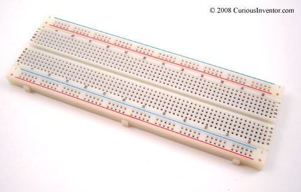
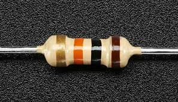
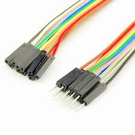
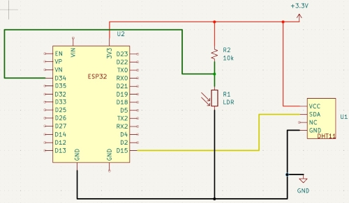
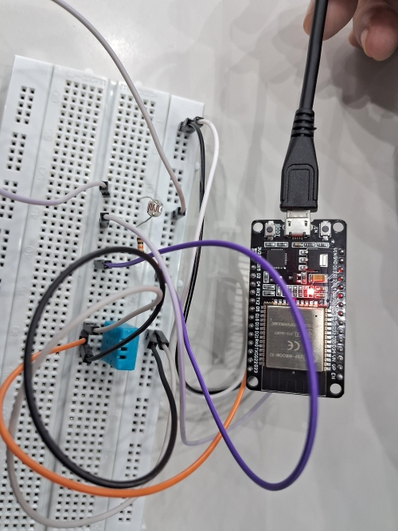
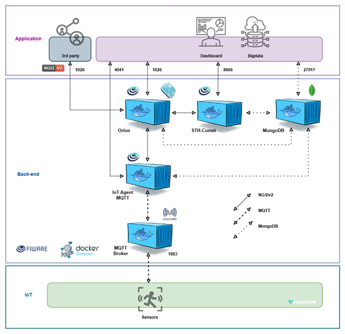

# Temperature, Humidity, and Luminosity Monitoring: Termonline


The project enables the monitoring of temperature, humidity, and light levels in an environment using an ESP32, MQTT communication to send real-time data, and storage of data in MongoDB. This repository contains the necessary code to connect to a Wi-Fi network and send data to an MQTT Broker, as well as to receive commands to turn an LED on and off when certain parameters fall outside the ideal range. It also implements a dashboard for visualizing data such as light, temperature, and humidity collected by an ESP32. It uses Dash to create a web interface that displays real-time graphs, with data obtained from an API and shown in line, bar, and pie charts.

The project works with the following variables in their respective ranges and triggers:

| Variable               | Range      | Trigger (%) | Component Precision         |
|------------------------|------------|-------------|-----------------------------|
| Light (LDR)            | 0 to 100%  | 0.1 to 30   | 12-bit resolution            |
| Humidity (DHT11)       | 0 to 100%  | 30 to 50    | ±5% RH                       |
| Temperature (DHT11)    | 0 to 50ºC  | 15 to 25    | ±2°C                         |

## Hardware

### Components

| Component               | Function                                                                | Images                                              |
|-------------------------|-------------------------------------------------------------------------|-----------------------------------------------------|
| Breadboard              | A device used for building temporary electronic circuits without soldering, facilitating experimentation. |  |
| ESP32                   | Responsible for connectivity and communication with the FIWARE platform, the ESP32 operates in a voltage range of 0V to 3.3V and allows real-time data transmission. Widely used in IoT (Internet of Things) projects due to its built-in Wi-Fi and Bluetooth connectivity. It has an onboard LED. |  |
| DHT11                   | A digital sensor that measures temperature and humidity in the environment. |  |
| LDR                     | A digital sensor that measures light levels in the environment. |  |
| 10KΩ Resistor           | Resistors protect components from excessive current and divide the circuit voltage, ensuring accurate analog signal readings. |  |
| Jumper Wires            | Used to physically connect components.                                    |  |

### Connections

| Component  | Connection                                                   |
|------------|--------------------------------------------------------------|
| DHT11      | Data pin (DHT11) - Pin 15 (ESP32) <br> VCC (DHT11) <br> GND (DHT11)                                                   |
| LDR        | Output pin (LDR) – Pin 34 (ESP32)                             |

### Electrical Diagram

Generated using Wokwi, the platform offers a visual interface for adding components, connecting wires, and writing code, as well as supporting popular libraries and a wide variety of sensors and devices.



### Physical Setup



## Software

### FIWARE

FIWARE is an open platform that provides tools and APIs for developing smart solutions, facilitating interoperability between systems, IoT devices, and applications. Its main component, the Orion Context Broker, manages contextual data in real time, allowing devices to share information. In this case, temperature, humidity, and light data are sent to FIWARE for automated decision-making. The platform's components, known as Generic Enablers, are deployed via Docker, which ensures scalability and portability. RESTful APIs ensure communication between systems, while the MQTT broker integrates data from the ESP32 into FIWARE for real-time processing and analysis.

#### Diagram (Layered Architecture) of the Application



### Dependencies

This project requires the following libraries to function:

- WiFi.h: Library to connect the ESP32 to the Wi-Fi network.
- PubSubClient.h: Library to enable MQTT communication with the Broker.
- DHT.h: Library for the DHT11 temperature and humidity sensor.

```cpp
#include <WiFi.h>
#include <PubSubClient.h>
#include <DHT.h>
```

Ensure that these libraries are installed before uploading the code. To install these libraries, open the Arduino IDE and go to **Sketch > Include Library > Manage Libraries....** Search for and install the libraries.

### Configurable Variables

In the code, update the following parameters as necessary:

- default_SSID: Wi-Fi network name
- default_PASSWORD: Wi-Fi network password
- default_BROKER_MQTT: MQTT Broker IP
- default_TOPICO_SUBSCRIBE: Topic to listen to receive commands from the Broker
- default_TOPICO_PUBLISH_*: Topics to publish information to the Broker
- default_ID_MQTT: Uniquely identifies a client connected to the MQTT Broker

```cpp
const char* default_SSID = "HORIZON"; // Wi-Fi network name
const char* default_PASSWORD = "1234567890"; // Wi-Fi network password
const char* default_BROKER_MQTT = "4.228.64.5"; // MQTT Broker IP
const int default_BROKER_PORT = 1883; // MQTT Broker port - **do not change**
const char* default_TOPICO_SUBSCRIBE = "/TEF/lamp06x/cmd"; // MQTT topic to listen to
const char* default_TOPICO_PUBLISH_1 = "/TEF/lamp06x/attrs"; // MQTT topic to send light information to Broker
const char* default_TOPICO_PUBLISH_2 = "/TEF/lamp06x/attrs/l"; // MQTT topic to send light information to Broker
const char* default_TOPICO_PUBLISH_3 = "/TEF/lamp06x/attrs/t"; // Send temperature
const char* default_TOPICO_PUBLISH_4 = "/TEF/lamp06x/attrs/h"; // Send humidity
const char* default_ID_MQTT = "fiware_06x"; // MQTT ID
```

### Aggregation Variables:
•	`float somaTemp`, `float somaLum`, `float somaUmi`: sum temperature, luminosity, and humidity values to calculate averages.  
•	`int contador`: counter to control the number of readings.  

```cpp
float somaTemp = 0;  
float somaLum = 0;  
float somaUmi = 0;  
int contador = 1;
```

### MQTT Communication Setup
•	`WiFiClient espClient`: creates a Wi-Fi client for the ESP32.<br>  
•	`PubSubClient MQTT(espClient)`: creates an MQTT client based on the Wi-Fi connection.<br>  
•	`char EstadoSaida = '0';`: stores the output state, used to represent the device's state or a control parameter.<br>  

```cpp
WiFiClient espClient;  
PubSubClient MQTT(espClient);  
char EstadoSaida = '0';
```

### MQTT Topic Structure
•	`TOPICO_SUBSCRIBE`: `/TEF/lamp06x/cmd` - Listens to commands (e.g., on/off). <br>  
•	`TOPICO_PUBLISH_1`: `/TEF/lamp06x/attrs` - Publishes the current state of the LED. <br>  
•	`TOPICO_PUBLISH_2`: `/TEF/lamp06x/dados` - Publishes sensor data, including temperature, luminosity, and humidity averages. 

### Functions
- **initSerial()**: Initializes Serial communication to track debugging messages on the Serial Monitor.
    ```cpp
    void initSerial() {
        Serial.begin(115200);
    }
    ```

- **initWiFi()**: Connects the ESP32 to the Wi-Fi network, displaying messages in Serial about the connection process.
    ```cpp
    void initWiFi() {
        delay(10);
        Serial.println("------Connecting to WI-FI------");
        Serial.print("Connecting to network: ");
        Serial.println(SSID);
        Serial.println("Please wait");
        reconectWiFi();
    }
    ```

- **initMQTT()**: Connects the ESP32 to the MQTT Broker and sets the callback to process incoming messages.
    ```cpp
    void initMQTT() {
        MQTT.setServer(BROKER_MQTT, BROKER_PORT);
        MQTT.setCallback(mqtt_callback);
    }
    ```

- **setup()**: Runs once when the device is powered on or reset. In this function, you configure and initialize all necessary components and variables for the device to function.
    ```cpp
    void setup() {
        dht.begin();
        InitOutput();
        initSerial();
        initWiFi();
        initMQTT();
        delay(5000); 
        MQTT.publish(TOPICO_PUBLISH_1, "s|on");
    }
    ```

- **loop()**: Executes continuously as long as the device is running. This is where repeated operations and readings are handled, such as maintaining the connection, monitoring sensors, and sending data.
    ```cpp
    void loop() {
        VerificaConexoesWiFIEMQTT();
        EnviaEstadoOutputMQTT();
        handleLuminosity();
        handleTemperature();
        handleHumidity();
        MQTT.loop();
    }
    ```

- **reconectWiFi()**: Checks and reconnects to Wi-Fi if disconnected.
    ```cpp
    void reconectWiFi() {
        if (WiFi.status() == WL_CONNECTED) return;
        WiFi.begin(SSID, PASSWORD);
        while (WiFi.status() != WL_CONNECTED) {
            delay(100);
            Serial.print(".");
        }
        Serial.println();
        Serial.println("Successfully connected to network ");
        Serial.print(SSID);
        Serial.println("IP obtained: ");
        Serial.println(WiFi.localIP());
        digitalWrite(D4, LOW);
    }
    ```

- **reconnectMQTT()**: Checks and reconnects to the MQTT Broker if the connection is lost.
    ```cpp
    void reconnectMQTT() {
        while (!MQTT.connected()) {
            Serial.print("* Attempting to connect to MQTT Broker: ");
            Serial.println(BROKER_MQTT);
            if (MQTT.connect(ID_MQTT)) {
                Serial.println("Successfully connected to MQTT Broker!");
                MQTT.subscribe(TOPICO_SUBSCRIBE);
            } else {
                Serial.println("Failed to reconnect to the broker.");
                Serial.println("Retrying in 2s");
                delay(2000);
            }
        }
    }
    ```

- **mqtt_callback()**: Receives and processes MQTT topic messages.
    ```cpp
    void mqtt_callback(char* topic, byte* payload, unsigned int length) {
        String msg;
        for (int i = 0; i < length; i++) {
            char c = (char)payload[i];
            msg += c;
        }
        Serial.print("- Message received: ");
        Serial.println(msg);

        String onTopic = String(topicPrefix) + "@on|";
        String offTopic = String(topicPrefix) + "@off|";

        if (msg.equals(onTopic)) {
            digitalWrite(D4, HIGH);
            EstadoSaida = '1';
        }

        if (msg.equals(offTopic)) {
            digitalWrite(D4, LOW);
            EstadoSaida = '0';
        }
    }
    ```

- **VerificaConexoesWiFIEMQTT()**: Monitors and reconnects Wi-Fi and MQTT Broker if needed.
    ```cpp
    void VerificaConexoesWiFIEMQTT() {
        if (!MQTT.connected()) reconnectMQTT();
        reconectWiFi();
    }
    ```

- **EnviaEstadoOutputMQTT()**: Sends the current LED state to the MQTT broker, allowing remote systems or devices to monitor whether the LED is on or off.
    ```cpp
    void EnviaEstadoOutputMQTT() {
        if (EstadoSaida == '1') {
            MQTT.publish(TOPICO_PUBLISH_1, "s|on");
            Serial.println("- LED On");
        }

        if (EstadoSaida == '0') {
            MQTT.publish(TOPICO_PUBLISH_1, "s|off");
            Serial.println("- LED Off");
        }
        Serial.println("- LED state sent to broker!");
        delay(1000);
    }
    ```

- **InitOutput()**: Configures the LED pin and performs a "blink" sequence to indicate the device has been initialized.
    ```cpp
    void InitOutput() {
        pinMode(D4, OUTPUT);
        digitalWrite(D4, HIGH);
        boolean toggle = false;

        for (int i = 0; i <= 10; i++) {
            toggle = !toggle;
            digitalWrite(D4, toggle);
            delay(200);
        }
    }
    ```

- **handleLuminosity()**: Reads the luminosity value, calculates the average every 10 readings, and publishes the average value to an MQTT topic.
    ```cpp
    void handleLuminosity() {
        const int potPin = 34;
        int sensorValue = analogRead(potPin);
        int luminosity = map(sensorValue, 1228, 4095, 0, 100);
        somaLum += luminosity;
        if(contador == 10){
            Serial.print("Luminosity value: ");
            float media = somaLum/10;
            String mensagem = String(media);
            Serial.println(mensagem.c_str());
            MQTT.publish(TOPICO_PUBLISH_2, mensagem.c_str());
            somaLum = 0;
        }
    }
    ```

- **handleTemperature()**: Reads the temperature from DHT11, calculates the average every 10 readings, and publishes the average value to an MQTT topic.
    ```cpp
    void handleTemperature() {
        float temperature = dht.readTemperature();
        somaTemp += temperature;
        if(contador == 10){
            Serial.print("Temperature value: ");
            float media = somaTemp/10;
            String mensagem = String(media);
            Serial.println(mensagem.c_str());
            MQTT.publish(TOPICO_PUBLISH_3, mensagem.c_str());
            somaTemp = 0;
        }
    }
    ```

- **handleHumidity()**: Reads humidity from DHT11, calculates the average every 10 readings, and publishes the average value to an MQTT topic.
    ```cpp
    void handleHumidity() {
        float humidity = dht.readHumidity();
        somaUmi += humidity;
        if(contador == 10){
            Serial.print("Humidity value: ");
            float media = somaUmi/10;
            String mensagem = String(media);
            Serial.println(mensagem.c_str());
            MQTT.publish(TOPICO_PUBLISH_4, mensagem.c_str());
            somaUmi = 0;
        }
    }
    ```

### Dashboard
#### Resources
*   **Real-Time Update:** Data is refreshed every 10 seconds.<br>
*   **Error Monitoring:** Detection of out-of-range values is displayed through bar and pie charts.<br>
*   **Lamp State Control:** The lamp state switches to "on" or "off" based on ambient conditions.<br>

#### Dependencies
The code requires the following libraries: dash, dash-bootstrap-components, plotly, requests, pytz, and pandas.<br>
To install, type the command:
```python
pip install dash dash-bootstrap-components plotly requests pytz pandas
```
    
#### Network Parameters
```python
IP_ADDRESS = "4.228.64.5"
PORT_STH = 8666
```

#### Data Limits
When values fall outside of these ranges, a trigger (signal) will occur. Note that there is a maximum and minimum value.

```python
triggerMinLum = 0
triggerMaxLum = 30
triggerMinTemp = 15
triggerMaxTemp = 25
triggerMinUmi = 30
triggerMaxUmi = 50
```

#### Data Acquisition and Processing Functions
•	get_data(lastN, dataType): Fetches data from the server for a specific data type (luminosity, temperature, or humidity), retrieving the most recent values based on the lastN parameter.<br>
•	turn_light(): Activates or deactivates the light depending on sensor states. If any sensor shows values outside the limit, the light is turned on; otherwise, it remains off.<br>
•	convert_to_sao_paulo_time(timestamps): Converts timestamps from UTC format to São Paulo time zone.<br>
#### Dashboard Layout and Data Storage
The layout is defined with html.Div and dcc.Graph for each chart (luminosity, temperature, humidity). Data is stored in dcc.Store, allowing access in callbacks.
#### Callbacks and Graph Updates
•	Data Update: The callback update_data_store updates luminosity, temperature, and humidity variables every 10 seconds. It also checks if values are within limits and adjusts the error state for each variable.<br>
•	Line Graphs: The callback update_graph updates line graphs to show recent sensor data.<br>
•	Bar and Pie Charts: updateErroGraph and UpdatePieGraph display the distribution of values within and outside of limits.<br>
#### Update Functions
•	generic_update_data_store: Stores data for the specified type (luminosity, temperature, humidity) and updates the variable's state.<br>
•	generic_update_graph: Configures and styles line graphs.<br>
•	generic_updateErroGraph: Creates bar charts to visualize quantities within and outside limits.<br>
•	generic_UpdatePieGraph: Displays a pie chart illustrating the proportion of values within and outside of limits.<br>
These functions are generalized to handle the three data types, allowing easy addition of new sensor types.<br>

## Youtube
Video pitch of Termonline: https://youtu.be/QfXlTfQ_lCk?si=MqdozVUPol8iKkov
<br>

## User Manual
First, the equipment must be powered on by a TermoLight team member. Then, a 2.4GHz Wi-Fi internet connection is required (it must be the same Wi-Fi registered by the team member). 
The installed TermoLight device has two sensors that capture ambient luminosity, temperature, and humidity, instantly transferred to the cloud through an ESP32 (Wi-Fi connector). These include an LDR light sensor connected to a 10kOhm resistor and a DHT11 temperature and humidity sensor. 
1.	Open the provided PYTHON file along with the sensors, and run it in Visual Studio;
2.	Open a web browser (of your choice), then use the search bar to enter “LOCALHOST:8050” to access the API that will load the sensor dashboards;
3.	A webpage with loaded dashboards will appear, showing current values captured by the sensors, along with previous values for analysis.

## References
CABRINI, Fabio. fiware. GitHub, n.d. Available at: https://github.com/fabiocabrini/fiware. Accessed on: Oct 16, 2024.<br>
CodeMagic LTD. Welcome to Wokwi! Available at: https://docs.wokwi.com/en/. Accessed on: Oct 2, 2024.<br>
DATASHEET DHT11: https://www.mouser.com/datasheet/2/758/DHT11-Technical-Data-Sheet-Translated-Version-1143054.pdf <br>
ESPRESSIF. ESP32 PDF. 2019. Available at: https://www.alldatasheet.com/datasheet-pdf/view/1148023/ESPRESSIF/ESP32.html. Accessed on: Sept 24, 2024.<br>
FAHIM, M., EL MHOUTI, A., BOUDAA, T. et al. Modeling and implementation of a low-cost IoT-smart weather monitoring station and air quality assessment based on fuzzy inference model and MQTT protocol. Model. Earth Syst. Environ. 9, 4085–4102 (2023). Available at: https://doi.org/10.1007/s40808-023-01701-w. Accessed on: Oct 2, 2024.<br>
HOLANDA, MARIA ANDRADE LUCENA. Development of firmware for LAICAnSta platform guidance navigation and control. p. 33, Brasília, Dec. 2016.<br>
MCROBERTS, Michael. Arduino Basics; [translation Rafael Zanolli]. – São Paulo: Novatec Editora, 2011.<br>
OHM, Georg Simon. Die galvanische Kette, mathematisch bearbeitet. 1827.<br>
SOUZA, F. What is firmware? Available at: https://embarcados.com.br/o-que-e-firmware/. Accessed on: Sept 28, 2024.<br>
Wokwi: [https://wokwi.com/projects/413299514799878145](https://wokwi.com/projects/412095412172389377)<br>
